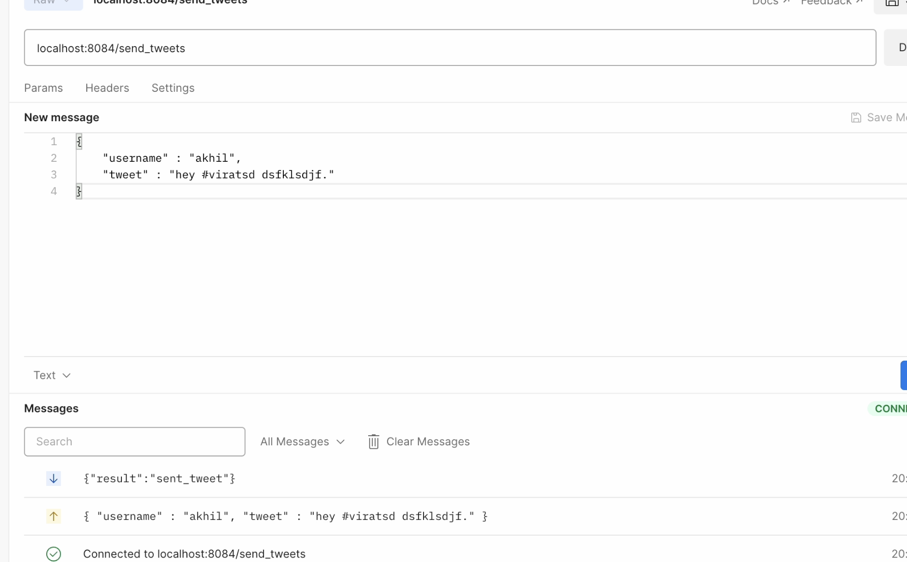

# **Twitter Engine Part 2  - COP 5615**

Youtube video link - https://www.youtube.com/watch?v=G37cUMv1F-k

## **Group members -**

1 - Mayur Reddy Junnuthula (UFID - 36921238)

2-  Akhil Srivatsa (UFID - 80826297)

## **Project Description**

## **Part 1 Recap**

Implement a Twitter-like engine with the following functionality:
Register account
Send tweet. Tweets can have hashtags (e.g. #COP5615isgreat) and mentions (@bestuser)
Subscribe to user's tweets
Re-tweets (so that your subscribers get an interesting tweet you got by other means)
Allow querying tweets subscribed to, tweets with specific hashtags, tweets in which the user is mentioned (my mentions)
If the user is connected, deliver the above types of tweets live (without querying)
Implement a tester/simulator to test the above
Simulate as many users as you can
Simulate periods of live connection and disconnection for users
Simulate a Zipf distribution on the number of subscribers. For accounts with a lot of subscribers, increase the number of tweets. Make some of these messages re-tweets
Other considerations:
The client part (send/receive tweets) and the engine (distribute tweets) have to be in separate processes. Preferably, you use multiple independent client processes that simulate thousands of clients and a single-engine process
You need to measure various aspects of your simulator and report performance
More detail in the lecture as the project progresses.

## **Project 4 Extensions (Part 2)** #
This is a continuation of Project 3 where the actor model calls are now replaced with WebSocket API calls. The added functionality is listed below:

1.  Designed a JSON based API that represents all messages and their replies (including errors)
2.  Re-written parts of the engine using WebSharper to implement the WebSocket interface
3.  Re-written parts of the client to use WebSockets.

## **BONUS PART** ##

1. <mark> A user after registration provides a public key. </mark> 

2. <mark> When the user re-connects via the websocket to request for any service, the engine sends a randomized mathematical challenge to the user, for example, 2 + 5, this is a 256 bit challenge and if the user fails to answer correctly, the websocket connection is terminated and the user has to retry. When the client sends a reply for the challenge, it is digital signed with the time included. The engine sends an acknowledgment if the answer is right or an error if it is not. The challenge is randomized evey time it is called and hence it is not cached. </mark>

3. <mark> The user establishes a secret key with the engine using HMAC which signs every message sent in the JSON Format. </mark>

## **Steps to Run the project** ##

- Our choice of IDE for the project is IntelliJ IDEA. Build the project and run it using the erlang console run configuration in IntelliJ IDEA with just default (zero) arguments and default settings.
- Use the command "make run" in the console to the run the application.

## **Twitter High Level Architecture**

## **File Structure and Application Details**

The main functionalities of the twitter clone are handled by various handlers which implement websockets to listen to the user's requests.
The description of each file is given below - 

1) **dosp_app.erl**

An opaque dispatch rules value is returned. This value must be given to Cowboy as a middleware environment value, and calls the respective handlers.

2) **"handler" files**

Decodes/parses the payload and sends the parsed value to the server for business logic execution.

3) **middleware.erl**

Authenticates payloads sent from the dosp_app.erl and routes them to the server.erl

4) **server.erl**

Initializes all tables and implements all business logic, then sends it back to the handler to send the result back to the client through the websockset.

The requests to the client can be sent using the following commands -

**Zip F Distribution -**

Here, the no.of tweets that a user makes is determined using ZIP F Distribution. The user with maximum no.of followers sends the "maximum no.of tweets".
The second most popular user will perform "maximum no.of tweets / 2" tweets. The third most popular user will perform "maximum no.of tweets / 3" tweets
and so on. The parameter "maximum no.of tweets" is taken as an input from the user.

**Periods of Live Connection and Disconnection**

Depending upon the parameter "percentage of users to disconnect", the users are periodically disconnected. This is taken as an input from the user.
**Please note that, the no.of users that will be disconnected will always be less than "percentage of users to disconnect".**

## **Performance Graphs -**

The performance results are taken for the parameter - "no.of users to disconnect" = 0. This means that all the users in the system are
active and the tweets will be delivered to all online users. The performance results will be much faster, when
the "**no.of users to disconnect > 0**" as the tweets will not have to be delivered to every subscribed user.

The logic to distribute the work is on the server side. For our testing purposes, we are running both the client and server on the same
system.  We were able to test for a maximum of 2000 users, but we are confident that, in a real life scenario our system can scale up to
100x depending on the CPU power of the server,

**Some Samples of Request/ Response -**

